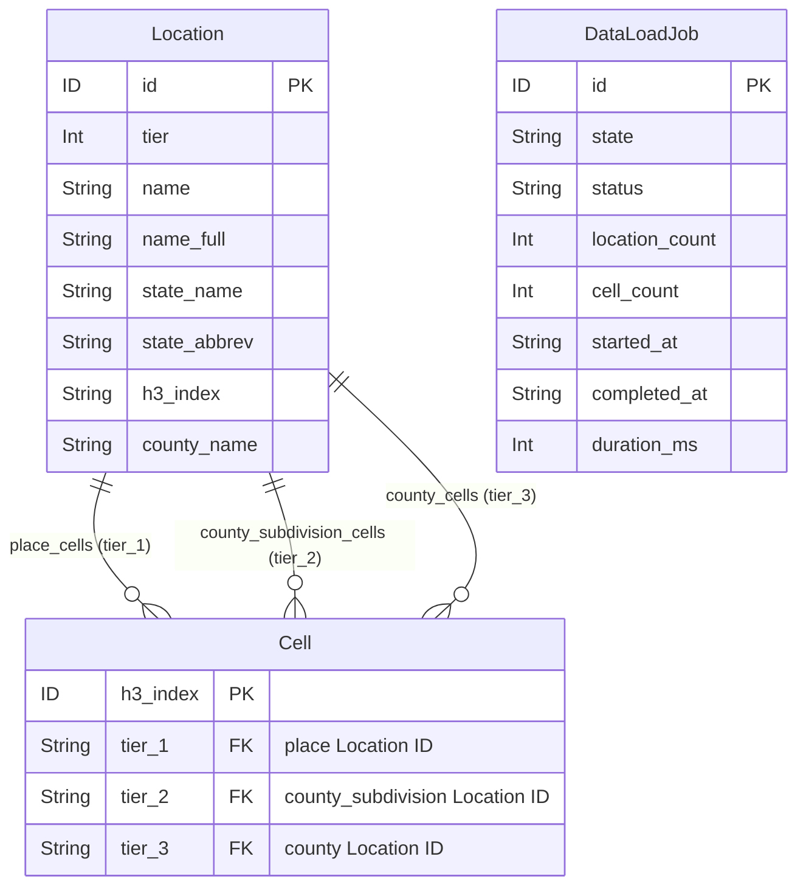
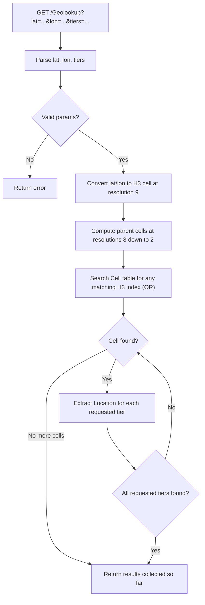
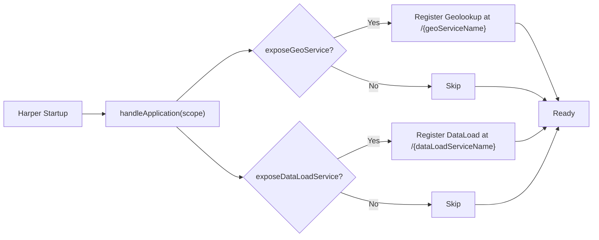
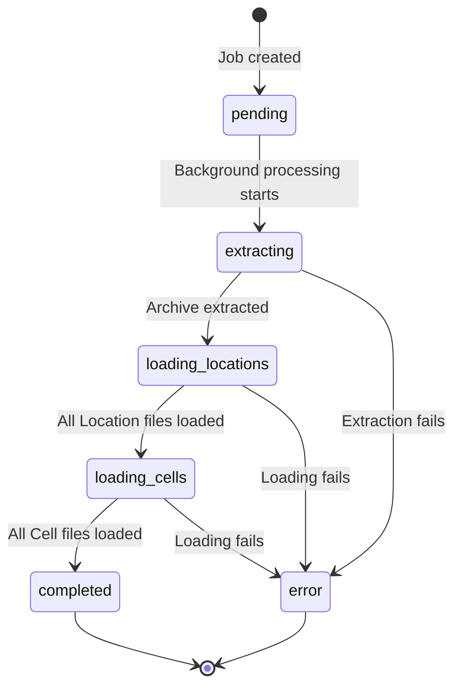

# Geolookup

A [Harper](https://www.harper.fast/) plugin that provides fast, tier-based reverse geocoding for the United States. Give it a latitude and longitude, and it will tell you where you are, down to the city, township, or county level. It won't judge you for being in New Jersey.

[](https://www.harper.fast/)

## How It Works

Geolookup converts a lat/lon coordinate into an [Uber H3](https://h3geo.org/) hexagonal cell index, then searches a pre-indexed table of cells to find the geographic locations that contain that point. The lookup walks from fine-grained resolution (H3 resolution 9, roughly a city block) up to coarse resolution (resolution 2, roughly a large region), checking for matches at each level until it finds results for all requested tiers.

The underlying geographic data is sourced from the [US Census TIGER/Line](https://www.census.gov/geographies/mapping-files/time-series/geo/tiger-line-file.html) shapefiles, converted to H3 hexagonal cells using [compact cell representation](#h3-compact-cells-and-why-they-matter).

## Tiers

Geographic locations in the US exist at different levels of administrative hierarchy. Geolookup organizes these into three tiers:

| Tier | Name | Census Entity | Coverage | Examples |
|------|------|---------------|----------|----------|
| **1** | `place` | Incorporated places and Census Designated Places (CDPs) | Partial. Only areas with an incorporated municipality or CDP designation. Rural and unincorporated areas often have no Tier 1 match. | "San Francisco", "Boise", "Chapel Hill" |
| **2** | `county_subdivision` | Minor Civil Divisions (MCDs) and Census County Divisions (CCDs) | **Full national coverage.** The Census Bureau ensures every square foot of the US falls within a county subdivision, creating statistical "unorganized territories" where no legal MCD exists. | "Springfield Township", "Falls Church city", "Northwest Arctic Borough" |
| **3** | `county` | Counties and county equivalents | **Full national coverage.** Every point in the US belongs to a county (or equivalent like a parish, borough, or independent city). | "Cook County", "Los Angeles County", "Orleans Parish" |

The practical takeaway: if you query for Tier 1 in the middle of a national forest, you may get nothing back. Tier 2 and Tier 3 will always return a result for any valid US coordinate. Plan your tier selection accordingly.

### Requesting Specific Tiers

The `tiers` query parameter controls which levels of geography are returned. You can request any combination:

| Value | Behavior |
|-------|----------|
| `all` (default) | Returns all three tiers |
| `1` | Place only |
| `2` | County subdivision only |
| `3` | County only |
| `1,3` | Place and county |
| `1,2,3` | Same as `all` |

If the `tiers` parameter is omitted, the service defaults to returning all tiers.

## Data Model

The schema defines two tables in the `geolookup` database, designed to work together for efficient spatial lookups.



### Location

The `Location` table stores geographic entities across all three tiers. Each record represents a single place, county subdivision, or county.

Key attributes:

| Field | Description |
|-------|-------------|
| `id` | Primary key |
| `tier` | Integer (1, 2, or 3) indicating the geographic level |
| `tier_label` | Human-readable tier name |
| `name` | Short name (e.g. "Springfield") |
| `name_full` | Full qualified name |
| `feature_type` | Census feature classification |
| `state_name` / `state_abbrev` | State information |
| `lat` / `lon` | Representative point for the location |
| `h3_index` | H3 cell index for the location's representative point |
| `country_code` | Country code (US) |
| `lsad` | Legal/Statistical Area Description code from Census |
| `county_name` / `county_fips` | Parent county info |
| `place_cells` | Relationship to Cell records (via `tier_1`) |
| `county_subdivision_cells` | Relationship to Cell records (via `tier_2`) |
| `county_cells` | Relationship to Cell records (via `tier_3`) |

### Cell

The `Cell` table is the spatial index. Each record represents a single H3 hexagonal cell and links to the Location(s) it belongs to at each tier.

| Field | Description |
|-------|-------------|
| `h3_index` | Primary key. The H3 cell index string. |
| `tier_1` | Location ID of the place this cell belongs to (if any) |
| `tier_2` | Location ID of the county subdivision this cell belongs to |
| `tier_3` | Location ID of the county this cell belongs to |
| `place` | Relationship to Location (from `tier_1`) |
| `county_subdivision` | Relationship to Location (from `tier_2`) |
| `county` | Relationship to Location (from `tier_3`) |

A single cell can belong to locations at multiple tiers simultaneously. For example, one H3 cell might be in the city of Denver (Tier 1), an MCD (Tier 2), and Denver County (Tier 3). The `@indexed` directive on `tier_1`, `tier_2`, and `tier_3` enables fast lookups from both directions: cell-to-location and location-to-cells.

### H3 Compact Cells and Why They Matter

The raw TIGER/Line shapefiles define geographic boundaries as polygons. To make these searchable via H3, each polygon is filled with H3 cells. A naive approach would store every cell at the finest resolution, but that would produce an enormous number of records.

Instead, Geolookup uses H3's **compact cell** representation. The `compactCells` operation replaces any group of 7 child cells that share the same parent with that single parent cell. This is applied recursively, producing a mixed-resolution set of cells that covers the exact same area with far fewer records. The [H3 documentation](https://h3geo.org/docs/core-library/restable/) shows the magnitude of this: a compact representation can be an order of magnitude smaller than its uncompacted equivalent.

This is why the lookup algorithm searches across resolutions 9 down to 2, rather than at a single fixed resolution. A query point might match a fine-grained resolution-9 cell in a densely covered urban area, or it might only match a coarser resolution-4 cell in a rural area where compaction was more aggressive. The algorithm generates the H3 index for the query point at resolution 9, then computes its parent cell at each coarser resolution, and searches for any of those cells in the database. The first match found at each tier is the answer.

This design gives you the best of both worlds: precise coverage without a bloated cell table.

## The Lookup Algorithm



Here is what happens when a request hits the Geolookup endpoint:

1. **Parse input.** Extract `lat`, `lon`, and `tiers` from query parameters.
2. **Generate H3 index.** Convert the coordinate to an H3 cell at resolution 9 using `latLngToCell()`.
3. **Build candidate set.** Compute the parent cell at each resolution from 8 down to 2 using `cellToParent()`. This produces 8 candidate cell indexes (resolutions 9, 8, 7, 6, 5, 4, 3, 2).
4. **Search cells.** Query the `Cell` table for any record matching one of the candidate H3 indexes. The query uses an OR condition across all candidates and includes relationship joins only for the requested tiers.
5. **Collect results.** As matching cells come back, extract the linked Location for each requested tier. Once all requested tiers have a result, stop early.
6. **Return.** Send back an object with keys for each requested tier (e.g. `place`, `county_subdivision`, `county`).

## Plugin Configuration

Geolookup is designed to be used as a Harper [plugin](https://docs.harperdb.io/docs/reference/components). The entry point is `src/index.ts`, which exports a `handleApplication()` function that Harper calls during startup.



### Installing as a Plugin

Geolookup is published on [npm](https://www.npmjs.com/package/geolookup-plugin) as `geolookup-plugin`. To use it in your Harper application, first install the package:

```sh
npm install geolookup-plugin
```

Then, in the consuming application's `config.yaml`, reference the Geolookup component and provide configuration options:

```yaml
'geolookup-plugin':
  package: 'geolookup-plugin'
  exposeGeoService: true
  geoServiceName: 'geo'
  exposeDataLoadService: true
  dataLoadServiceName: 'dataload'
```

### Configuration Options

| Option | Type | Default | Description |
|--------|------|---------|-------------|
| `exposeGeoService` | `boolean` | `false` | When `true`, the Geolookup resource is registered and accessible via REST at the path specified by `geoServiceName`. When `false` or omitted, the plugin loads but does not expose a lookup endpoint. Useful if you want to import and use the `Geolookup` class programmatically without a public-facing REST route. |
| `geoServiceName` | `string` | - | The name under which the Geolookup resource is registered. This becomes the URL path segment for the endpoint (e.g. setting it to `"geo"` exposes the service at `/geo`). Required when `exposeGeoService` is `true`. |
| `exposeDataLoadService` | `boolean` | `false` | When `true`, the DataLoad resource is registered and accessible via REST at the path specified by `dataLoadServiceName`. Provides a bulk data loading endpoint for populating the `Location` and `Cell` tables from pre-packaged state data files. |
| `dataLoadServiceName` | `string` | - | The name under which the DataLoad resource is registered. This becomes the URL path segment for the endpoint (e.g. setting it to `"dataload"` exposes the service at `/dataload`). Required when `exposeDataLoadService` is `true`. |

### Exports

The plugin module exports the following classes, types, and functions:

| Export | Kind | Description |
|--------|------|-------------|
| `Geolookup` | Class | Reverse geocoding resource. Can be used programmatically or registered as a REST endpoint. |
| `DataLoad` | Class | Bulk data loading resource for populating Location and Cell tables. |
| `Location` | Type | TypeScript interface for Location records (places, county subdivisions, counties). |
| `Cell` | Type | TypeScript interface for Cell records (H3 spatial index entries). |
| `RequestTarget` | Type | Re-export of Harper's `RequestTarget` type for typing resource method parameters. |
| `handleApplication` | Function | Plugin entry point called by Harper during startup. Typically not imported directly. |

```ts
import { Geolookup, DataLoad } from 'geolookup-plugin';
import type { Location, Cell } from 'geolookup-plugin';
```

## API Usage

### Basic Lookup (All Tiers)

```sh
curl "http://localhost:9926/Geolookup?lat=40.7128&lon=-74.0060"
```

Response:

```json
{
  "place": {
    "id": "...",
    "tier": 1,
    "name": "New York",
    "name_full": "New York city",
    "state_name": "New York",
    "state_abbrev": "NY",
    "h3_index": "...",
    "country_code": "US",
    "county_name": "New York"
  },
  "county_subdivision": {
    "id": "...",
    "tier": 2,
    "name": "Manhattan",
    "name_full": "Manhattan borough",
    "state_name": "New York",
    "state_abbrev": "NY",
    "h3_index": "...",
    "country_code": "US",
    "county_name": "New York"
  },
  "county": {
    "id": "...",
    "tier": 3,
    "name": "New York County",
    "name_full": "New York County",
    "state_name": "New York",
    "state_abbrev": "NY",
    "h3_index": "...",
    "country_code": "US",
    "county_name": "New York"
  }
}
```

### Single Tier

```sh
curl "http://localhost:9926/Geolookup?lat=40.7128&lon=-74.0060&tiers=3"
```

Response:

```json
{
  "county": {
    "id": "...",
    "tier": 3,
    "name": "New York County",
    ...
  }
}
```

### Multiple Tiers

```sh
curl "http://localhost:9926/Geolookup?lat=40.7128&lon=-74.0060&tiers=1,3"
```

Response includes only `place` and `county` (no `county_subdivision`).

### Query Parameters

| Parameter | Required | Description |
|-----------|----------|-------------|
| `lat` | Yes | Latitude (decimal degrees) |
| `lon` | Yes | Longitude (decimal degrees) |
| `tiers` | No | Comma-separated tier numbers (`1`, `2`, `3`) or `all`. Defaults to `all`. |

## Data Loading

Geographic data is pre-packaged as `.tar.gz` files in the `data/` directory, one per state or territory. The `DataLoad` endpoint validates the requested state, creates a tracking job, and immediately returns the job ID. The actual data extraction and loading runs asynchronously in the background. Progress is tracked in the `DataLoadJob` table, which is exported and can be queried directly at any time.

### DataLoad Endpoint

> **Important:** The DataLoad endpoint is intended for initial data seeding only. Once all desired states have been loaded, set `exposeDataLoadService` to `false` in your `config.yaml` to disable the endpoint. There is no need to keep it exposed during normal operation.

**`GET /DataLoad?state={state}`**

Initiates a data load for the given state. The `state` parameter is case-insensitive (it is lowercased internally). The endpoint validates that a matching `.tar.gz` file exists before creating the job.

```sh
curl "http://localhost:9926/DataLoad?state=Wyoming"
```

Response (returns immediately):

```json
{
  "jobId": "a1b2c3d4-e5f6-7890-abcd-ef1234567890"
}
```

The returned `jobId` can be used to check progress via the `DataLoadJob` endpoint.

If the state is invalid or no data file exists, an error is returned synchronously:

```json
{
  "error": "No data file found for state: wyoming"
}
```

#### What happens in the background

1. **Extracting** — The `.tar.gz` archive is extracted to the `data/` directory
2. **Loading locations** — All JSON files from the `{state}/Location/` folder are loaded into the `Location` table. The job's `location_count` is updated after each file.
3. **Loading cells** — All JSON files from the `{state}/Cell/` folder are loaded into the `Cell` table. The job's `cell_count` is updated after each file.
4. **Cleanup** — The extracted state folder is deleted (even on error)

All database writes within each file are wrapped in a Harper [transaction](https://docs.harperdb.io/docs/reference/transactions) for performance.

#### DataLoad Query Parameters

| Parameter | Required | Description |
|-----------|----------|-------------|
| `state` | Yes | Name of the state or territory to load (case-insensitive). Must match a `.tar.gz` file in the `data/` directory. |

### DataLoadJob Endpoint

**`GET /DataLoadJob/{jobId}`**

The `DataLoadJob` table is exported as a REST resource, so you can query it directly to check the status of a data load job using the `jobId` returned by the `DataLoad` endpoint.

```sh
curl "http://localhost:9926/DataLoadJob/a1b2c3d4-e5f6-7890-abcd-ef1234567890"
```

Response:

```json
{
  "id": "a1b2c3d4-e5f6-7890-abcd-ef1234567890",
  "state": "wyoming",
  "status": "completed",
  "error_message": null,
  "location_count": 152,
  "cell_count": 8432,
  "started_at": "2026-03-06T12:00:00.000Z",
  "completed_at": "2026-03-06T12:00:45.000Z",
  "duration_ms": 45000
}
```

You can also list all jobs:

```sh
curl "http://localhost:9926/DataLoadJob"
```

#### DataLoadJob Fields

| Field | Description |
|-------|-------------|
| `id` | Job ID (UUID) |
| `state` | The state being loaded |
| `status` | Current job status (see table below) |
| `error_message` | Error details if status is `error`, otherwise `null` |
| `location_count` | Number of `Location` records loaded so far |
| `cell_count` | Number of `Cell` records loaded so far |
| `started_at` | ISO 8601 timestamp when the job was created |
| `completed_at` | ISO 8601 timestamp when the job finished (or errored) |
| `duration_ms` | Total elapsed time in milliseconds |

#### Job Statuses



| Status | Description |
|--------|-------------|
| `pending` | Job created, processing has not started |
| `extracting` | Extracting the `.tar.gz` archive |
| `loading_locations` | Loading records into the `Location` table |
| `loading_cells` | Loading records into the `Cell` table |
| `completed` | All data loaded successfully |
| `error` | An error occurred (see `error_message`) |

### Available States and Territories

The following states and territories have pre-packaged data files available for loading:

| States | | | |
|--------|--------|--------|--------|
| alabama | alaska | arizona | arkansas |
| california | colorado | connecticut | delaware |
| florida | georgia | hawaii | idaho |
| illinois | indiana | iowa | kansas |
| kentucky | louisiana | maine | maryland |
| massachusetts | michigan | minnesota | mississippi |
| missouri | montana | nebraska | nevada |
| new hampshire | new jersey | new mexico | new york |
| north carolina | north dakota | ohio | oklahoma |
| oregon | pennsylvania | rhode island | south carolina |
| south dakota | tennessee | texas | utah |
| vermont | virginia | washington | west virginia |
| wisconsin | wyoming | | |

| Territories | |
|-------------|-------------|
| american samoa | cnmi |
| dc | guam |
| puerto rico | usvi |

## Development

### Prerequisites

- [Node.js](https://nodejs.org/) v24+ (see `.nvmrc`)
- [Harper](https://docs.harperdb.io/docs/deployments/install-harper) installed globally: `npm install -g harperdb`

### Setup

After cloning the repo, install the agent skills used for development:

```sh
npm run agent:skills:update
```

### Running Locally

```sh
npm run dev
```

This starts the Harper dev server at [http://localhost:9926](http://localhost:9926).

### Testing

```sh
npm test                              # run all tests
npm run test:watch                    # run tests in watch mode
node --test test/geolookup.test.js    # run a single test file
```

Tests use the Node.js built-in test runner (`node:test`) and `node:assert/strict`.

### Linting and Formatting

```sh
npm run lint       # ESLint
npm run format     # Prettier
```

## Deployment

Configure your `.env` file with your [Harper Fabric](https://fabric.harper.fast/) cluster credentials (see `.env.example`), then:

```sh
npm run deploy
```

A GitHub Actions workflow (`.github/workflow/deploy.yaml`) is also included for CI/CD deployment via `workflow_dispatch`.

## Example Application

For a working implementation of this plugin, see [geolookup-example](https://github.com/kylebernhardy/geolookup-example). It's a minimal Harper application that wires up the geocoding and data loading endpoints via `config.yaml`, and includes an interactive CLI for bulk loading state data with real-time progress tracking.

## Links

- [geolookup-example](https://github.com/kylebernhardy/geolookup-example) — Reference implementation with interactive data loading CLI
- [Harper Documentation](https://docs.harperdb.io/docs)
- [Harper Fabric](https://fabric.harper.fast/)
- [Harper Components Reference](https://docs.harperdb.io/docs/reference/components)
- [Harper Resource Class Reference](https://docs.harperdb.io/docs/reference/resources)
- [H3: Uber's Hexagonal Hierarchical Spatial Index](https://h3geo.org/)
- [US Census TIGER/Line Shapefiles](https://www.census.gov/geographies/mapping-files/time-series/geo/tiger-line-file.html)
