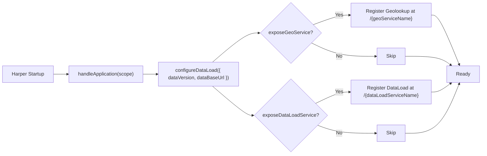
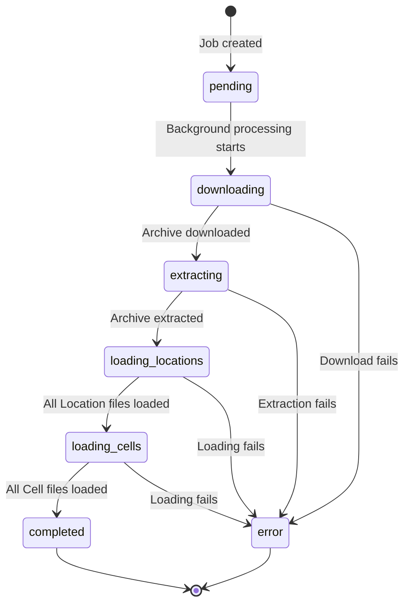

# Decouple geolookup-plugin data loader Implementation Plan

> **For agentic workers:** REQUIRED SUB-SKILL: Use superpowers:subagent-driven-development (recommended) or superpowers:executing-plans to implement this plan task-by-task. Steps use checkbox (`- [ ]`) syntax for tracking.

**Goal:** Stop shipping the 40MB `data/` directory inside the npm package. Make the plugin fetch versioned state tarballs from GitHub Releases on demand, replace the sandbox-incompatible `execFileSync('tar', ...)` extraction with `node-tar`, and add a small dev script that publishes data releases.

**Architecture:** `DataLoad.get()` resolves a base URL + data-version (defaults baked in, both overridable via plugin config). It fetches `${baseUrl}/${dataVersion}/${state}.tar.gz` into an `os.tmpdir()` workspace, extracts via `tar.x`, runs the existing `loadTableFiles` loop, then deletes the workspace. A new `scripts/publish-data.mjs` walks a local `data/` directory and creates/updates a GitHub Release via the `gh` CLI. Tests use Node's built-in `node:test` runner with mocked Harper globals (same pattern as the current `test/dataload.test.js`) and mocked `fetch` for the download path.

**Tech Stack:** Node.js 24, TypeScript via type stripping, Harper plugin SDK, `tar` npm package (pure JS), `node:test`, `gh` CLI.

---

## File Structure

**Modified:**
- `src/types.ts` — add `dataVersion` and `dataBaseUrl` to `GeolookupConfig`
- `src/resources/DataLoad.ts` — replace `execFileSync`, add download flow, plumb config
- `src/index.ts` — pass `dataVersion`/`dataBaseUrl` through to `DataLoad`
- `package.json` — add `tar` dep, drop `data/` from `"files"`, add `data:publish` script
- `README.md` — rewrite the "Data Loading" section
- `CLAUDE.md` — reflect the new architecture
- `test/dataload.test.js` — adjust mocks for the new flow

**Created:**
- `src/dataConfig.ts` — exports `DEFAULT_DATA_VERSION`, `DEFAULT_DATA_BASE_URL`, `buildTarUrl()`
- `src/resources/dataDownload.ts` — `downloadStateTar()`, `extractStateTar()` helpers
- `scripts/publish-data.mjs` — releases the local `data/` directory to a `gh` release
- `test/dataDownload.test.js` — covers URL construction, download, extract
- `test/fixtures/tiny-state.tar.gz` — 2-record tarball used by extraction tests

**Removed (later, after a release exists):**
- `data/*.tar.gz` from `package.json` `"files"` (kept on disk + in git for now; optional history purge is a separate runbook)

---

## Task 0: Branch & baseline

**Files:**
- None (env check)

- [ ] **Step 1: Confirm working tree is clean and we're on `main`**

Run: `git -C /home/berns/WebstormProjects/geolookup status` and `git -C /home/berns/WebstormProjects/geolookup branch --show-current`
Expected: clean tree, branch `main`.

- [ ] **Step 2: Create the feature branch**

Run: `git -C /home/berns/WebstormProjects/geolookup checkout -b decouple-data-loader`
Expected: `Switched to a new branch 'decouple-data-loader'`.

- [ ] **Step 3: Run the existing test suite to confirm a green baseline**

Run: `cd /home/berns/WebstormProjects/geolookup && npm test`
Expected: all tests pass (3 test files: `dataload.test.js`, `geolookup.test.js`, `handleApplication.test.js`).

- [ ] **Step 4: Confirm `node --version` matches `.nvmrc`**

Run: `node --version && cat /home/berns/WebstormProjects/geolookup/.nvmrc`
Expected: both report `v24.13.x` (minor may differ; major must match).

---

## Task 1: Add `tar` dependency, swap `execFileSync` for `tar.x`

**Files:**
- Modify: `package.json` (add dep)
- Modify: `src/resources/DataLoad.ts:2,65`

- [ ] **Step 1: Install `tar` as a runtime dependency**

Run: `cd /home/berns/WebstormProjects/geolookup && npm install tar@7`
Expected: `package.json` and `package-lock.json` updated with `"tar": "^7.x.x"` under `dependencies`.

- [ ] **Step 2: Replace the import and the extraction call**

Edit `src/resources/DataLoad.ts` — swap lines 2 and 65:

```ts
// at the top, REMOVE:
//   import { execFileSync } from 'node:child_process';
// and ADD:
import { extract as tarExtract } from 'tar';
```

```ts
// inside processDataLoad(), REPLACE:
//   execFileSync('tar', ['-xzf', tarPath, '-C', DATA_DIR]);
// with:
await tarExtract({ file: tarPath, cwd: DATA_DIR });
```

Also drop the now-stale `// Uses execFileSync (no shell)...` comment above the line and replace with:
```ts
// node-tar (pure JS) — avoids spawning a child process so Harper's sandbox can load this module
```

- [ ] **Step 3: Sanity-build the TypeScript to catch type errors**

Run: `cd /home/berns/WebstormProjects/geolookup && npm run build`
Expected: completes with no errors (script is `tsc || true`, but no errors should print).

- [ ] **Step 4: Run the existing dataload tests to confirm they still pass**

Run: `cd /home/berns/WebstormProjects/geolookup && node --test test/dataload.test.js`
Expected: all tests pass.

- [ ] **Step 5: Commit**

```bash
git add package.json package-lock.json src/resources/DataLoad.ts
git commit -m "fix(DataLoad): replace execFileSync with node-tar

execFileSync is excluded from Harper's sandboxed child_process replacement,
which caused the module to fail to link in consuming apps. node-tar is pure
JS and uses only allowed builtins."
```

---

## Task 2: Centralize data version + base URL config

**Files:**
- Create: `src/dataConfig.ts`
- Modify: `src/types.ts:14` (extend `GeolookupConfig`)
- Test: `test/dataDownload.test.js` (new, just URL building for now)

- [ ] **Step 1: Write the failing URL test**

Create `test/dataDownload.test.js`:

```js
import assert from 'node:assert/strict';
import { test } from 'node:test';
import { buildTarUrl, DEFAULT_DATA_BASE_URL, DEFAULT_DATA_VERSION } from '../src/dataConfig.ts';

test('buildTarUrl composes default URL', () => {
	const url = buildTarUrl('colorado');
	assert.equal(url, `${DEFAULT_DATA_BASE_URL}/${DEFAULT_DATA_VERSION}/colorado.tar.gz`);
});

test('buildTarUrl URL-encodes state names with spaces', () => {
	const url = buildTarUrl('new york');
	assert.match(url, /\/new%20york\.tar\.gz$/);
});

test('buildTarUrl honors overridden base + version', () => {
	const url = buildTarUrl('utah', { dataVersion: 'data-test', dataBaseUrl: 'https://example.test/r' });
	assert.equal(url, 'https://example.test/r/data-test/utah.tar.gz');
});

test('buildTarUrl strips trailing slash from custom base URL', () => {
	const url = buildTarUrl('utah', { dataBaseUrl: 'https://example.test/r/' });
	assert.equal(url, `https://example.test/r/${DEFAULT_DATA_VERSION}/utah.tar.gz`);
});
```

- [ ] **Step 2: Run it to verify it fails**

Run: `cd /home/berns/WebstormProjects/geolookup && node --test test/dataDownload.test.js`
Expected: FAIL — `Cannot find module '../src/dataConfig.ts'`.

- [ ] **Step 3: Implement `src/dataConfig.ts`**

```ts
/** Default GitHub release tag used to fetch state data archives. Bump when publishing a new data revision. */
export const DEFAULT_DATA_VERSION = 'data-2026.05';

/** Default base URL for state data archive downloads. */
export const DEFAULT_DATA_BASE_URL = 'https://github.com/kylebernhardy/geolookup/releases/download';

export interface BuildTarUrlOptions {
	dataVersion?: string;
	dataBaseUrl?: string;
}

/**
 * Builds the download URL for a state archive.
 *
 * @param state - Lowercase state/territory name (may contain spaces; URL-encoded internally)
 * @param opts - Optional overrides for base URL and data version
 * @returns Fully-qualified URL to the .tar.gz asset
 */
export function buildTarUrl(state: string, opts: BuildTarUrlOptions = {}): string {
	const base = (opts.dataBaseUrl ?? DEFAULT_DATA_BASE_URL).replace(/\/+$/, '');
	const version = opts.dataVersion ?? DEFAULT_DATA_VERSION;
	const encodedState = encodeURIComponent(state);
	return `${base}/${version}/${encodedState}.tar.gz`;
}
```

- [ ] **Step 4: Extend `GeolookupConfig`**

In `src/types.ts`, after line 13 (`dataLoadServiceName?: string;`) and before the closing brace at line 15, add:

```ts
    /** Override the data-archive base URL. Defaults to the geolookup GitHub Releases URL. */
    dataBaseUrl?: string;

    /** Override the data revision tag (e.g. `"data-2026.05"`). Defaults to the version baked into the plugin. */
    dataVersion?: string;
```

- [ ] **Step 5: Run the test, verify it passes**

Run: `cd /home/berns/WebstormProjects/geolookup && node --test test/dataDownload.test.js`
Expected: all 4 tests pass.

- [ ] **Step 6: Commit**

```bash
git add src/dataConfig.ts src/types.ts test/dataDownload.test.js
git commit -m "feat: add dataVersion/dataBaseUrl config + buildTarUrl helper"
```

---

## Task 3: Download + extract helpers

**Files:**
- Create: `src/resources/dataDownload.ts`
- Create: `test/fixtures/tiny-state.tar.gz` (committed test asset)
- Modify: `test/dataDownload.test.js` (add extract test using the fixture)

- [ ] **Step 1: Build the test fixture tarball**

This creates a tiny tarball matching the on-disk layout the existing `loadTableFiles` expects (`<state>/Location/*.json`, `<state>/Cell/*.json`).

```bash
cd /home/berns/WebstormProjects/geolookup
mkdir -p test/fixtures/_build/tinyland/Location test/fixtures/_build/tinyland/Cell
cat > test/fixtures/_build/tinyland/Location/locations.json <<'JSON'
[{"id":"loc-1","tier":3,"name":"Tinyland"}]
JSON
cat > test/fixtures/_build/tinyland/Cell/cells.json <<'JSON'
[{"h3_index":"892a1072023ffff","tier_3":"loc-1"}]
JSON
tar -czf test/fixtures/tiny-state.tar.gz -C test/fixtures/_build tinyland
rm -rf test/fixtures/_build
```

Verify: `tar -tzf test/fixtures/tiny-state.tar.gz` lists three entries (`tinyland/`, `tinyland/Cell/cells.json`, `tinyland/Location/locations.json`).

- [ ] **Step 2: Add failing tests for download + extract**

Append to `test/dataDownload.test.js`:

```js
import { mkdtemp, readFile, rm, writeFile, stat } from 'node:fs/promises';
import { tmpdir } from 'node:os';
import { join } from 'node:path';
import { downloadStateTar, extractStateTar } from '../src/resources/dataDownload.ts';

test('extractStateTar unpacks a tar.gz into the target directory', async () => {
	const workDir = await mkdtemp(join(tmpdir(), 'geolookup-test-'));
	try {
		await extractStateTar(new URL('./fixtures/tiny-state.tar.gz', import.meta.url).pathname, workDir);
		const locations = JSON.parse(await readFile(join(workDir, 'tinyland/Location/locations.json'), 'utf-8'));
		assert.equal(locations[0].id, 'loc-1');
		const cells = JSON.parse(await readFile(join(workDir, 'tinyland/Cell/cells.json'), 'utf-8'));
		assert.equal(cells[0].h3_index, '892a1072023ffff');
	} finally {
		await rm(workDir, { recursive: true, force: true });
	}
});

test('downloadStateTar writes the response body to disk', async () => {
	const workDir = await mkdtemp(join(tmpdir(), 'geolookup-test-'));
	const destPath = join(workDir, 'sample.tar.gz');
	const fixturePath = new URL('./fixtures/tiny-state.tar.gz', import.meta.url).pathname;
	const fixtureBytes = await readFile(fixturePath);

	const originalFetch = globalThis.fetch;
	globalThis.fetch = async (url) => {
		assert.equal(url, 'https://example.test/sample.tar.gz');
		return new Response(fixtureBytes, { status: 200 });
	};
	try {
		await downloadStateTar('https://example.test/sample.tar.gz', destPath);
		const written = await readFile(destPath);
		assert.equal(written.length, fixtureBytes.length);
	} finally {
		globalThis.fetch = originalFetch;
		await rm(workDir, { recursive: true, force: true });
	}
});

test('downloadStateTar throws on non-2xx response', async () => {
	const workDir = await mkdtemp(join(tmpdir(), 'geolookup-test-'));
	const destPath = join(workDir, 'sample.tar.gz');
	const originalFetch = globalThis.fetch;
	globalThis.fetch = async () => new Response('not found', { status: 404 });
	try {
		await assert.rejects(
			() => downloadStateTar('https://example.test/missing.tar.gz', destPath),
			/404/,
		);
	} finally {
		globalThis.fetch = originalFetch;
		await rm(workDir, { recursive: true, force: true });
	}
});
```

- [ ] **Step 3: Run the tests, verify they fail**

Run: `cd /home/berns/WebstormProjects/geolookup && node --test test/dataDownload.test.js`
Expected: FAIL — `Cannot find module '../src/resources/dataDownload.ts'`.

- [ ] **Step 4: Implement `src/resources/dataDownload.ts`**

```ts
import { createWriteStream } from 'node:fs';
import { Readable } from 'node:stream';
import { pipeline } from 'node:stream/promises';
import { extract as tarExtract } from 'tar';

/**
 * Downloads a tar.gz archive to a local file path.
 * Throws if the HTTP response is not 2xx or has no body.
 *
 * @param url - Fully-qualified URL of the archive
 * @param destPath - Absolute path the archive will be written to
 */
export async function downloadStateTar(url: string, destPath: string): Promise<void> {
	const res = await fetch(url);
	if (!res.ok) {
		throw new Error(`Failed to download ${url}: HTTP ${res.status}`);
	}
	if (!res.body) {
		throw new Error(`Failed to download ${url}: empty response body`);
	}
	await pipeline(Readable.fromWeb(res.body as any), createWriteStream(destPath));
}

/**
 * Extracts a tar.gz archive into the target directory using node-tar.
 *
 * @param tarPath - Absolute path to the .tar.gz file
 * @param destDir - Absolute path to the directory that will receive the extracted contents
 */
export async function extractStateTar(tarPath: string, destDir: string): Promise<void> {
	await tarExtract({ file: tarPath, cwd: destDir });
}
```

- [ ] **Step 5: Run the tests, verify they pass**

Run: `cd /home/berns/WebstormProjects/geolookup && node --test test/dataDownload.test.js`
Expected: all tests pass (URL + extract + download success + download failure).

- [ ] **Step 6: Commit**

```bash
git add src/resources/dataDownload.ts test/fixtures/tiny-state.tar.gz test/dataDownload.test.js
git commit -m "feat: add downloadStateTar + extractStateTar helpers"
```

---

## Task 4: Rewire `DataLoad.get()` to download-then-extract

**Files:**
- Modify: `src/resources/DataLoad.ts` (entire `get()` + `processDataLoad()` flow)
- Modify: `src/index.ts:21-30` (pass config through)
- Modify: `test/dataload.test.js` (update mocks + add downloading-status test)

- [ ] **Step 1: Update `DataLoad.ts` to accept config and use the download flow**

Replace the contents of `src/resources/DataLoad.ts` with:

```ts
import { databases, RequestTarget, Resource } from 'harperdb';
import { readFileSync, readdirSync, existsSync } from 'node:fs';
import { mkdtemp, rm } from 'node:fs/promises';
import { tmpdir } from 'node:os';
import { join } from 'node:path';
import { randomUUID } from 'node:crypto';
import { buildTarUrl } from '../dataConfig.ts';
import { downloadStateTar, extractStateTar } from './dataDownload.ts';

const { Location, Cell, DataLoadJob } = databases.geolookup;

/** Per-instance config injected by handleApplication() in src/index.ts. */
let runtimeConfig: { dataVersion?: string; dataBaseUrl?: string } = {};

export function configureDataLoad(opts: { dataVersion?: string; dataBaseUrl?: string }) {
	runtimeConfig = { ...opts };
}

async function loadTableFiles(
	dir: string,
	table: { put(id: string, record: unknown, txn: unknown): Promise<void> },
	idField: string,
	jobId: string,
	countField: string,
) {
	let count = 0;
	if (!existsSync(dir)) return count;

	const files = readdirSync(dir).filter((f) => f.endsWith('.json'));
	for (const file of files) {
		const records = JSON.parse(readFileSync(join(dir, file), 'utf-8'));
		await transaction(async (txn) => {
			for (const record of records) {
				await table.put(record[idField], record, txn);
				count++;
			}
		});
		await DataLoadJob.patch(jobId, { [countField]: count });
	}
	return count;
}

async function processDataLoad(jobId: string, state: string) {
	const startTime = Date.now();
	let locationCount = 0;
	let cellCount = 0;
	const workDir = await mkdtemp(join(tmpdir(), `geolookup-${jobId}-`));
	const tarPath = join(workDir, `${state}.tar.gz`);
	const url = buildTarUrl(state, runtimeConfig);

	try {
		await DataLoadJob.patch(jobId, { status: 'downloading' });
		await downloadStateTar(url, tarPath);

		await DataLoadJob.patch(jobId, { status: 'extracting' });
		await extractStateTar(tarPath, workDir);

		const stateDir = join(workDir, state);
		if (!existsSync(stateDir)) {
			throw new Error(`Expected directory ${state} not found after extraction`);
		}

		await DataLoadJob.patch(jobId, { status: 'loading_locations' });
		locationCount = await loadTableFiles(join(stateDir, 'Location'), Location, 'id', jobId, 'location_count');

		await DataLoadJob.patch(jobId, { status: 'loading_cells' });
		cellCount = await loadTableFiles(join(stateDir, 'Cell'), Cell, 'h3_index', jobId, 'cell_count');

		await DataLoadJob.patch(jobId, {
			status: 'completed',
			location_count: locationCount,
			cell_count: cellCount,
			completed_at: new Date().toISOString(),
			duration_ms: Date.now() - startTime,
		});
	} catch (err: any) {
		await DataLoadJob.patch(jobId, {
			status: 'error',
			error_message: err.message,
			location_count: locationCount,
			cell_count: cellCount,
			completed_at: new Date().toISOString(),
			duration_ms: Date.now() - startTime,
		});
	} finally {
		await rm(workDir, { recursive: true, force: true });
	}
}

/**
 * Async bulk loading endpoint. Validates the request, creates a DataLoadJob
 * record for tracking, and returns the job ID immediately. The actual download,
 * extraction, and loading run in the background — callers poll DataLoadJob.
 */
export class DataLoad extends Resource {
	async get(target: RequestTarget) {
		const state = target.get('state');
		if (!state) {
			return { error: 'state query parameter is required' };
		}

		const stateLower = state.toLowerCase();
		const jobId = randomUUID();
		await DataLoadJob.put(jobId, {
			state: stateLower,
			status: 'pending',
			location_count: 0,
			cell_count: 0,
			started_at: new Date().toISOString(),
		});

		processDataLoad(jobId, stateLower).catch(() => {});
		return { jobId };
	}
}
```

Note: `DATA_DIR` is gone — every job uses its own `mkdtemp` workspace. The `tar file not found` pre-check is also gone, since we discover that via the 404 from `downloadStateTar` and surface it through the job's `error_message`.

- [ ] **Step 2: Plumb config through `src/index.ts`**

Edit `src/index.ts` — after the existing `if (options.exposeDataLoadService) { ... }` block, add a call to `configureDataLoad` so the values land regardless of whether the endpoint is exposed:

```ts
import {Geolookup} from './resources/Geolookup.js';
import {DataLoad, configureDataLoad} from './resources/DataLoad.js';
import {Scope} from 'harperdb';
import type {GeolookupConfig} from "./types.js";
export {Geolookup, DataLoad};
export type {Location, Cell} from './types.js';
export type {RequestTarget} from './types.js'

export function handleApplication(scope: Scope) {
    const options = (scope.options.getAll() || {}) as GeolookupConfig;

    configureDataLoad({
        dataVersion: options.dataVersion,
        dataBaseUrl: options.dataBaseUrl,
    });

    if (options.exposeGeoService) {
        scope.resources.set(options.geoServiceName, Geolookup);
    }

    if (options.exposeDataLoadService) {
        scope.resources.set(options.dataLoadServiceName, DataLoad);
    }
}
```

- [ ] **Step 3: Update `test/dataload.test.js` mocks**

The existing test patches Harper globals and re-imports the resource via inline construction. Read the existing file at `test/dataload.test.js` and:

1. Remove any assertion that checks for a pre-existing `${stateLower}.tar.gz` file (no longer how the flow works).
2. Add a mock `globalThis.fetch` that returns the fixture tarball bytes:

```js
import { readFileSync } from 'node:fs';

const fixtureBytes = readFileSync(new URL('./fixtures/tiny-state.tar.gz', import.meta.url));
beforeEach(() => {
	globalThis.fetch = async () => new Response(fixtureBytes, { status: 200 });
});
```

3. Add a new test asserting that `processDataLoad` posts a `downloading` status before `extracting`:

```js
test('processDataLoad transitions through downloading → extracting → loading → completed', async () => {
	// existing mock plumbing creates `patchCalls` array
	const { DataLoad } = createDataLoad();
	const target = createMockTarget({ state: 'tinyland' });
	const { jobId } = await new DataLoad().get(target);
	// background work has been kicked off; wait a tick for it to finish
	await new Promise((r) => setTimeout(r, 50));
	const statuses = patchCalls.filter((c) => c.id === jobId && c.data.status).map((c) => c.data.status);
	assert.deepStrictEqual(statuses.slice(0, 4), ['downloading', 'extracting', 'loading_locations', 'loading_cells']);
	assert.equal(statuses[statuses.length - 1], 'completed');
});
```

If the existing test scaffolding doesn't already expose `transaction` as a mock, add `globalThis.transaction = async (fn) => fn({});` in the `beforeEach`.

- [ ] **Step 4: Run all tests**

Run: `cd /home/berns/WebstormProjects/geolookup && npm test`
Expected: all tests pass (geolookup, dataload, dataDownload, handleApplication).

- [ ] **Step 5: Build TS to dist/**

Run: `cd /home/berns/WebstormProjects/geolookup && npm run build`
Expected: no errors. `dist/resources/DataLoad.js`, `dist/resources/dataDownload.js`, `dist/dataConfig.js` exist.

- [ ] **Step 6: Commit**

```bash
git add src/resources/DataLoad.ts src/resources/dataDownload.ts src/dataConfig.ts src/index.ts src/types.ts test/dataload.test.js test/dataDownload.test.js
git commit -m "feat(DataLoad): fetch state archives from GitHub Releases on demand

DataLoad no longer reads from the bundled data/ directory. Instead it
downloads ${dataBaseUrl}/${dataVersion}/${state}.tar.gz into an
os.tmpdir() workspace, extracts with node-tar, then runs the existing
loadTableFiles loop. Job status now includes a 'downloading' step."
```

---

## Task 5: Publish-data script

**Files:**
- Create: `scripts/publish-data.mjs`
- Modify: `package.json` (`scripts.data:publish`)

- [ ] **Step 1: Author the publish script**

Create `scripts/publish-data.mjs`:

```js
#!/usr/bin/env node
/**
 * Publishes the local data/*.tar.gz files to a GitHub Release.
 *
 * Usage:
 *   node scripts/publish-data.mjs <tag> [--draft] [--notes "..."]
 *
 * Requires:
 *   - `gh` CLI installed and authenticated (`gh auth status`)
 *   - data/ directory populated with state .tar.gz files
 *
 * Behavior:
 *   1. Creates the release with `gh release create <tag>` (idempotent: if the
 *      release already exists, falls through to upload).
 *   2. Uploads every data/*.tar.gz as a release asset (`--clobber` overwrites
 *      any existing asset with the same name).
 */
import { spawnSync } from 'node:child_process';
import { readdirSync, existsSync, statSync } from 'node:fs';
import { join } from 'node:path';

const DATA_DIR = new URL('../data/', import.meta.url).pathname;

function gh(args, opts = {}) {
	const result = spawnSync('gh', args, { stdio: 'inherit', ...opts });
	if (result.status !== 0) {
		throw new Error(`gh ${args.join(' ')} exited with status ${result.status}`);
	}
}

function ghQuiet(args) {
	return spawnSync('gh', args, { stdio: ['ignore', 'pipe', 'pipe'], encoding: 'utf-8' });
}

const [, , tag, ...rest] = process.argv;
if (!tag) {
	console.error('Usage: node scripts/publish-data.mjs <tag> [--draft] [--notes "..."]');
	process.exit(1);
}

if (!existsSync(DATA_DIR)) {
	console.error(`data/ directory not found at ${DATA_DIR}`);
	process.exit(1);
}

const tarballs = readdirSync(DATA_DIR)
	.filter((f) => f.endsWith('.tar.gz'))
	.map((f) => join(DATA_DIR, f));

if (tarballs.length === 0) {
	console.error(`No .tar.gz files found in ${DATA_DIR}`);
	process.exit(1);
}

console.log(`Publishing ${tarballs.length} tarballs to release ${tag}…`);

const existing = ghQuiet(['release', 'view', tag]);
if (existing.status !== 0) {
	const draft = rest.includes('--draft') ? ['--draft'] : [];
	const notesIdx = rest.indexOf('--notes');
	const notes = notesIdx >= 0 && rest[notesIdx + 1] ? ['--notes', rest[notesIdx + 1]] : ['--notes', `Data release ${tag}`];
	gh(['release', 'create', tag, '--title', tag, ...notes, ...draft]);
} else {
	console.log(`Release ${tag} already exists — uploading assets with --clobber.`);
}

let totalBytes = 0;
for (const tarball of tarballs) {
	totalBytes += statSync(tarball).size;
}
console.log(`Uploading ${(totalBytes / 1024 / 1024).toFixed(1)} MB across ${tarballs.length} files…`);

gh(['release', 'upload', tag, ...tarballs, '--clobber']);

console.log(`\nDone. Release: $(gh release view ${tag} --json url -q .url || true)`);
```

- [ ] **Step 2: Wire the npm script and mark it executable**

Edit `package.json` `scripts` block — add:

```json
"data:publish": "node scripts/publish-data.mjs"
```

Run: `chmod +x /home/berns/WebstormProjects/geolookup/scripts/publish-data.mjs`

- [ ] **Step 3: Dry-run the script's argument handling**

Run: `cd /home/berns/WebstormProjects/geolookup && node scripts/publish-data.mjs`
Expected: prints the `Usage:` line and exits with status 1.

Run: `cd /home/berns/WebstormProjects/geolookup && node -e "import('./scripts/publish-data.mjs')" 2>&1 | head -5`
Expected: prints the `Usage:` line (loading the module triggers the entrypoint, but no `gh` calls fire because the tag arg is missing).

- [ ] **Step 4: Commit**

```bash
git add scripts/publish-data.mjs package.json
git commit -m "chore: add scripts/publish-data.mjs for releasing state data tarballs"
```

---

## Task 6: Publish the initial data release (MANUAL)

**Files:** none in this repo — this is a release-cutting step.

> ⚠️ This task fires real network calls and uploads ~40MB to GitHub. It must run before Task 7 removes `data/` from the package, otherwise consumers can't fetch tarballs.

- [ ] **Step 1: Verify `gh` is authenticated for `kylebernhardy/geolookup`**

Run: `gh auth status`
Expected: signed in to github.com.

Run: `gh repo view kylebernhardy/geolookup --json nameWithOwner`
Expected: `{"nameWithOwner":"kylebernhardy/geolookup"}`.

- [ ] **Step 2: Cut the release**

Run: `cd /home/berns/WebstormProjects/geolookup && npm run data:publish -- data-2026.05 --notes "Initial decoupled-data release (US states + territories)."`
Expected: `gh release create` succeeds, then asset uploads stream for ~30s, then `Done. Release: https://github.com/kylebernhardy/geolookup/releases/tag/data-2026.05`.

- [ ] **Step 3: Verify a state tarball is publicly fetchable**

Run: `curl -fsSLI "https://github.com/kylebernhardy/geolookup/releases/download/data-2026.05/colorado.tar.gz" | head -3`
Expected: `HTTP/2 302` (GitHub redirects to its CDN), final URL returns `200` with `Content-Length` matching `data/colorado.tar.gz` on disk.

---

## Task 7: Stop shipping `data/` in the npm package

**Files:**
- Modify: `package.json` (`files` array)

- [ ] **Step 1: Drop `data/` from the package files allowlist**

Edit `package.json` — locate the `"files"` array:

```json
"files": [
    "dist/",
    "schemas/",
    "data/",
    "config.yaml",
    "LICENSE",
    "README.md"
],
```

Remove the `"data/",` line.

- [ ] **Step 2: Verify the packaged tarball no longer contains `data/`**

Run: `cd /home/berns/WebstormProjects/geolookup && npm pack --dry-run 2>&1 | grep -E "(data/|Tarball)" | head`
Expected: NO lines containing `data/`. Tarball size dropped to <1MB.

- [ ] **Step 3: Commit**

```bash
git add package.json
git commit -m "chore: stop shipping data/ in the npm package

State archives are now fetched from GitHub Releases on demand. The
data/ directory remains in the repo as the source for publish-data.mjs."
```

---

## Task 8: Documentation refresh

**Files:**
- Modify: `README.md` (Plugin Configuration + Data Loading sections)
- Modify: `CLAUDE.md` (architecture bullets)

This task makes **surgical edits** to preserve the existing curl examples, JSON shapes, and `DataLoadJob` field table — don't nuke and rewrite. Apply each step in order.

### README — Plugin Configuration section

- [ ] **Step 1: Append `dataVersion` / `dataBaseUrl` rows to the Configuration Options table**

In `README.md`, find the `### Configuration Options` table (around line 192). After the existing `dataLoadServiceName` row (and before the next blank line), insert:

```markdown
| `dataVersion` | `string` | Plugin-baked default (e.g. `"data-2026.05"`) | Override the data revision tag the loader fetches at runtime. Set this in a consuming app's `config.yaml` to pin a specific dataset, or to roll forward to a newer one without upgrading the plugin's npm version. |
| `dataBaseUrl` | `string` | `"https://github.com/kylebernhardy/geolookup/releases/download"` | Override the base URL the loader fetches archives from. Useful for mirrors, internal proxies, air-gapped environments, or pointing tests at a local fake server. |
```

- [ ] **Step 2: Add commented overrides to the "Installing as a Plugin" config.yaml example**

Find the config.yaml block at lines 183-190. Replace it with:

```yaml
'geolookup-plugin':
  package: 'geolookup-plugin'
  exposeGeoService: true
  geoServiceName: 'geo'
  exposeDataLoadService: true
  dataLoadServiceName: 'dataload'
  # Optional — override the data revision tag (default baked into the plugin):
  # dataVersion: 'data-2026.05'
  # Optional — override the archive base URL (defaults to GitHub Releases):
  # dataBaseUrl: 'https://github.com/kylebernhardy/geolookup/releases/download'
```

- [ ] **Step 3 (optional polish): Update the Plugin Startup Flow Mermaid**

The diagram at lines 158-171 doesn't show the new `configureDataLoad` step. Skip if not worth the diff churn; otherwise replace with:

````markdown

````

### README — Data Loading section

- [ ] **Step 4: Rewrite the Data Loading intro paragraph**

Replace the paragraph at line 304 (the one starting "Geographic data is pre-packaged…") with:

```markdown
Geographic data is **not bundled** with the plugin. On demand, the `DataLoad` endpoint creates a tracking job and immediately returns the job ID. The background worker downloads the requested state's `.tar.gz` from the [geolookup GitHub Releases](https://github.com/kylebernhardy/geolookup/releases) into an OS temp directory, extracts it with `node-tar`, and loads `Location` and `Cell` records into Harper. The temp directory is removed when the job finishes (success or error). Progress is tracked in the `DataLoadJob` table, which is exported and can be queried directly at any time.
```

- [ ] **Step 5: Insert a `### Configuration` subsection inside Data Loading**

Immediately after the intro paragraph from Step 4 and before the existing `### DataLoad Endpoint` heading, insert:

````markdown
### Configuration

The loader uses defaults baked into the plugin for both the data revision tag and the archive base URL. Override either via plugin config (see [`dataVersion`](#configuration-options) / [`dataBaseUrl`](#configuration-options)). For example, to pin a specific data release in a consuming app's `config.yaml`:

```yaml
'geolookup-plugin':
  exposeDataLoadService: true
  dataLoadServiceName: 'dataload'
  dataVersion: 'data-2026.05'
```
````

- [ ] **Step 6: Reword the "Important" callout under DataLoad Endpoint**

The current callout (line 308) reasons about "data files." After our changes the rationale shifts — keep the advice, freshen the language. Replace with:

```markdown
> **Important:** The DataLoad endpoint is intended for initial data seeding only. Once the states you need are loaded, set `exposeDataLoadService` to `false` in your `config.yaml` to remove the route. Your geocoding lookups don't need it during normal operation, and disabling it reduces your app's exposed surface area.
```

- [ ] **Step 7: Replace the "No data file" synchronous error case**

The block at lines 328-334 (the `{ "error": "No data file found for state: wyoming" }` example) describes a code path that no longer exists — the loader doesn't pre-check; missing release assets surface asynchronously via the job's `error_message`. Replace that block with:

```markdown
If the `state` query param is missing, the endpoint returns `{ "error": "state query parameter is required" }` synchronously. Any other failure (download 404, extraction error, load failure) surfaces asynchronously: poll `DataLoadJob/<jobId>` and read `status` (which becomes `"error"`) and `error_message`.
```

- [ ] **Step 8: Update "What happens in the background"**

Replace the numbered list at lines 336-343 (everything between `#### What happens in the background` and the next `####` heading) with:

```markdown
1. **Downloading** — The `.tar.gz` for the requested state is fetched from `${dataBaseUrl}/${dataVersion}/${state}.tar.gz` (defaults to GitHub Releases on the geolookup repo) and streamed to a per-job temp directory under `os.tmpdir()`.
2. **Extracting** — The archive is extracted into the same temp directory using `node-tar` (pure JS — no system `tar` CLI required).
3. **Loading locations** — All JSON files under `{state}/Location/` in the extracted tree are loaded into the `Location` table. The job's `location_count` is updated after each file.
4. **Loading cells** — All JSON files under `{state}/Cell/` are loaded into the `Cell` table. The job's `cell_count` is updated after each file.
5. **Cleanup** — The temp directory is deleted (success or failure).
```

- [ ] **Step 9: Add `downloading` to the Job Statuses Mermaid**

Replace the entire Mermaid block at lines 399-411 with:

````markdown

````

- [ ] **Step 10: Add a `downloading` row to the Job Statuses table**

In the table at lines 413-420, insert a new row between `pending` and `extracting`:

```markdown
| `downloading` | Fetching the `.tar.gz` archive from the configured base URL |
```

- [ ] **Step 11: Update the "Available States and Territories" intro**

Replace the line at 424 ("The following states and territories have pre-packaged data files available for loading:") with:

```markdown
The following states and territories have data archives published in the [geolookup GitHub Releases](https://github.com/kylebernhardy/geolookup/releases). Pass any of these names (case-insensitive) as the `state` query parameter:
```

The two tables that follow are unchanged.

- [ ] **Step 12: Append a "Publishing a New Data Release" subsection**

After the territories table (around line 446) and before the `## Development` heading (line 448), insert:

````markdown
### Publishing a New Data Release

Maintainers cut a new data release after refreshing `data/`:

```bash
npm run data:publish -- data-YYYY.MM
```

This uploads every `data/*.tar.gz` to a `data-YYYY.MM` GitHub Release via the `gh` CLI. After publishing, bump `DEFAULT_DATA_VERSION` in `src/dataConfig.ts`, run `npm test` and `npm run build`, then cut a new npm release of the plugin so consumers pick up the new default. (Consumers can also pin to a specific data release via the `dataVersion` config option without upgrading the plugin.)
````

### CLAUDE.md

- [ ] **Step 13: Update CLAUDE.md architecture bullets**

In `CLAUDE.md`, find the architecture bullet for `src/resources/DataLoad.ts` (around line 18). Replace that single bullet with these four bullets:

```markdown
- `src/resources/DataLoad.ts` -Bulk data loading endpoint. Accepts a `state` query param, creates a `DataLoadJob` record, and returns the job ID immediately. Background work downloads the state's `.tar.gz` from a GitHub Release (URL = `${dataBaseUrl}/${dataVersion}/${state}.tar.gz`), extracts it to an `os.tmpdir()` workspace via `node-tar`, loads JSON into `Location` and `Cell` tables, and cleans up. Status transitions: `pending → downloading → extracting → loading_locations → loading_cells → completed`/`error`.
- `src/resources/dataDownload.ts` -`downloadStateTar()` and `extractStateTar()` helpers used by DataLoad. Pure functions, easy to unit-test with mocked `fetch`.
- `src/dataConfig.ts` -`DEFAULT_DATA_VERSION`, `DEFAULT_DATA_BASE_URL`, and `buildTarUrl()`. Bump `DEFAULT_DATA_VERSION` when publishing a new data release.
- `scripts/publish-data.mjs` -Dev script that uploads `data/*.tar.gz` to a GitHub Release via the `gh` CLI. Run with `npm run data:publish -- <tag>`.
```

Then find the bullet describing `data/` (currently "pre-packaged `.tar.gz` files per state/territory containing Location and Cell JSON data") and replace it with:

```markdown
- `data/` -Source `.tar.gz` files used by `scripts/publish-data.mjs` to cut releases. **Not** shipped in the npm package; consumers download from GitHub Releases at runtime.
```

### Verify + commit

- [ ] **Step 14: Render-check the README locally**

Open `README.md` in a Markdown preview (WebStorm: right-click → "Open in Browser" / "Show Markdown Preview"). Confirm:
- The `### Configuration Options` table renders cleanly with the two new rows
- The Job Statuses Mermaid diagram includes the `downloading` node
- The Data Loading section reads top-to-bottom: intro → Configuration → DataLoad Endpoint → DataLoadJob Endpoint → Available States → Publishing
- No remaining mentions of "pre-packaged data files" or the old `No data file found` synchronous error

- [ ] **Step 15: Commit**

```bash
git add README.md CLAUDE.md
git commit -m "docs: describe new data-fetch flow, config options, and publish workflow"
```

---

## Task 9: End-to-end verification in stormscout

**Files:**
- None in this repo — consumes the new build from `/home/berns/WebstormProjects/stormscout`.

- [ ] **Step 1: Pack the new plugin and install it in stormscout**

Run:
```bash
cd /home/berns/WebstormProjects/geolookup
npm pack
# captures the version into a tarball, e.g. geolookup-plugin-0.1.10.tgz
mv geolookup-plugin-*.tgz /tmp/geolookup-plugin-local.tgz
cd /home/berns/WebstormProjects/stormscout
npm install /tmp/geolookup-plugin-local.tgz
```
Expected: install succeeds, `node_modules/geolookup-plugin/dist/resources/DataLoad.js` no longer contains `execFileSync`.

Verify: `grep -c "execFileSync" /home/berns/WebstormProjects/stormscout/node_modules/geolookup-plugin/dist/resources/DataLoad.js` → `0`.

- [ ] **Step 2: Restart Harper**

Find the running Harper PID, then:

```bash
kill $(pgrep -f "harper run .")  # graceful SIGTERM
cd /home/berns/WebstormProjects/stormscout && npm run start &
```

Tail the log to confirm a clean startup:

```bash
tail -f /home/berns/harper/log/hdb.log
```

Expected: NO `Failed to load resource module .../openweather-reverse-geocode.ts` errors.

- [ ] **Step 3: Hit `/weather/current` to confirm the endpoint loads**

Run: `curl -si "http://localhost:9926/weather/current?lat=39.74&lon=-104.99&units=metric&lang=en" | head -5`
Expected: `HTTP/1.1 401 Unauthorized` (the resource now loads — auth is the next check). NOT a 500 with the SyntaxError body.

- [ ] **Step 4: Trigger a real data load and verify status progression**

Authenticate via Google OAuth in the browser at `http://localhost:9926/`, then trigger a load (use a state with a tiny archive so this is fast):

```bash
# Replace <session-cookie> with the cookie value from the browser dev tools
curl -s "http://localhost:9926/dataload?state=dc" -H "Cookie: <session-cookie>"
# returns {"jobId":"<uuid>"}
```

Poll the job:

```bash
curl -s "http://localhost:9926/DataLoadJob/<uuid>" -H "Cookie: <session-cookie>"
```

Expected: status progresses `pending` → `downloading` → `extracting` → `loading_locations` → `loading_cells` → `completed`. `location_count > 0`, `cell_count > 0`.

- [ ] **Step 5: Click a map location in stormscout and confirm a weather card renders**

Open `http://localhost:9926/` in the browser, click on the DC area. Weather panel populates with real OpenWeather data. No 500s in the network tab.

- [ ] **Step 6: Roll back the local install (so stormscout's lockfile isn't polluted)**

Run: `cd /home/berns/WebstormProjects/stormscout && git checkout package.json package-lock.json && npm install`

---

## Task 10: Cut the plugin release & open PR

**Files:**
- Modify: `package.json` (`version`)

- [ ] **Step 1: Bump version**

Edit `package.json`:
```json
"version": "0.2.0",
```
(`0.x.0` bump because this changes packaging behavior and adds a runtime download — semver-minor for pre-1.0.)

- [ ] **Step 2: Run the full test suite + build one more time**

Run: `cd /home/berns/WebstormProjects/geolookup && npm test && npm run build`
Expected: green.

- [ ] **Step 3: Commit version bump**

```bash
git add package.json
git commit -m "chore: bump to 0.2.0"
```

- [ ] **Step 4: Push the branch and open a PR**

Run:
```bash
git push -u origin decouple-data-loader
gh pr create --title "Decouple data loader: fetch from GitHub Releases, drop bundled data" --body "$(cat <<'EOF'
## Summary
- Replace `execFileSync('tar', ...)` with `node-tar` so the plugin loads in Harper's sandboxed module loader.
- Fetch state tarballs from GitHub Releases on demand; new `dataVersion` / `dataBaseUrl` config options let consumers pin or mirror.
- Add `scripts/publish-data.mjs` for cutting future data releases.
- Drop `data/` from the npm package (saves ~40MB per install).

## Test plan
- [x] `npm test` (unit + integration via fixtures)
- [x] `npm pack --dry-run` shows no `data/` entries
- [x] stormscout consumes the new build, `/weather/current` loads, `/dataload?state=dc` runs end-to-end and completes
EOF
)"
```

---

## Optional follow-up: purge `data/` tarballs from git history (DESTRUCTIVE)

> Skip unless you've decided you want to shrink the on-disk repo size. This rewrites history and requires a coordinated force-push. Do this **after** the PR above merges and a new release is cut.

- [ ] **Step 1: Confirm no other branches reference the old blobs**

Run: `git -C /home/berns/WebstormProjects/geolookup branch -a` and ensure only `main` (and the just-merged feature branch) exist.

- [ ] **Step 2: Mirror-clone for safety**

```bash
cd /tmp && git clone --mirror https://github.com/kylebernhardy/geolookup geolookup-purge.git
```

- [ ] **Step 3: Purge with `git filter-repo`**

```bash
cd /tmp/geolookup-purge.git
git filter-repo --path-glob 'data/*.tar.gz' --invert-paths
```

- [ ] **Step 4: Inspect, then force-push**

```bash
git log --oneline --all | head
du -sh /tmp/geolookup-purge.git
git push --force --mirror https://github.com/kylebernhardy/geolookup
```

- [ ] **Step 5: Tell everyone with a local clone to re-clone**

(In this project: just you and any CI runners.)

---

## Verification matrix

| Concern | How it's verified |
|---|---|
| `execFileSync` no longer imported | `grep execFileSync src/` returns empty (Task 1) |
| Tar extraction works | `extractStateTar` test against `tiny-state.tar.gz` fixture (Task 3) |
| Download URL composition | `buildTarUrl` unit tests for default, override, encoding (Task 2) |
| Failed downloads surface as job errors | `downloadStateTar` rejects on 404; `processDataLoad` catches into `status: 'error'` (Task 3 + Task 4) |
| Job status progression | `dataload.test.js` asserts the ordered status list (Task 4) |
| Package no longer ships `data/` | `npm pack --dry-run` output (Task 7) |
| Sandbox-compatible in real Harper | stormscout's `/weather/current` returns 401 (not 500) after upgrade (Task 9) |
| End-to-end data load | DC load completes via `/dataload?state=dc` in stormscout (Task 9) |
